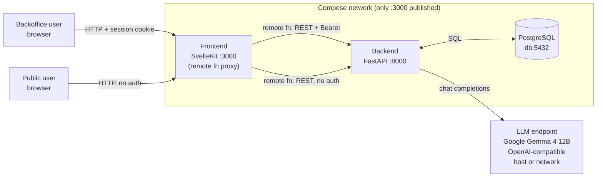

# Frontend — Real Estate AI Assistant

SvelteKit UI for the Real Estate AI Assistant. The browser talks to SvelteKit; SvelteKit talks to the FastAPI backend. Demo: <http://localhost:3000> after `docker compose up` at the repo root.

## Quickstart

The fastest way to run the full stack is compose (from the repo root):

```sh
cp .env.example .env
# edit .env: set SEED_ADMIN_PASSWORD (needed to log in) and
# LLM_BASE_URL / LLM_MODEL (needed for the AI chat). See comments in
# .env.example for the right LLM_BASE_URL on Docker Desktop vs Linux.
docker compose up --build
# open http://localhost:3000
```

To run only the frontend against a FastAPI process on `:8000`:

```sh
bun install
cp .env.example .env   # set BACKEND_PREFIX=http://localhost:8000
bun run dev
```

## Features

- **`/login`** — email/password sign-in (Skeleton card form).
- **`/public/ai-chat`** — anonymous AI chat; chat id is a UUID kept in `localStorage`, no account required.
- **`/dashboard`** — operator home.
- **`/dashboard/properties`** — property CRUD (list, new, view, edit, delete) with filters.
- **`/dashboard/ai-escalations`** — review human-handoff escalations with full chat transcript.

## Tech stack

- **SvelteKit 2.70** + **Svelte 5** (runes, `await` in templates).
- **Bun 1** as package manager and runtime; `svelte-adapter-bun` for production.
- **TypeScript 5**.
- **Tailwind v4** via `@tailwindcss/vite`.
- **Skeleton v3** (`@skeletonlabs/skeleton` + `@skeletonlabs/skeleton-svelte`, theme `cerberus`).
- **`bits-ui`** — headless primitives (available for future pages).
- **`valibot`** — standard-schema validation in remote functions.
- **Google Gemma 4 12B** — the LLM behind `/public/ai-chat` and the authed chat, served from any OpenAI-compatible endpoint. Dev default is llama.cpp at `LLM_BASE_URL`; production runs vLLM.
- SvelteKit experimental: `compilerOptions.experimental.async`, `kit.experimental.remoteFunctions`, `kit.experimental.explicitEnvironmentVariables`.

## Architecture (frontend view)

The browser never talks to the FastAPI backend directly. All traffic enters through the SvelteKit frontend, which proxies requests to the backend in-network. The backend is not published; only the frontend's port (`3000`) is exposed.



## Local development

All commands below assume you're in `frontend/`. Prerequisite: Bun 1+ and a reachable FastAPI backend.

Install:

```sh
bun install
```

### Environment

Create `frontend/.env`. The frontend reads a small set of server-side env vars, declared in `src/env.ts` and imported via `$app/env/private`:

| Var | Required | Purpose |
| --- | --- | --- |
| `BACKEND_PREFIX` | yes | URL the SvelteKit server uses to call FastAPI. `http://localhost:8000` for a local FastAPI process; `http://backend:8000` to reach a compose-managed backend over its in-network hostname. |
| `ORIGIN` | yes | Browser-facing URL. SvelteKit rejects POSTs whose `Origin` header doesn't match. |
| `NODE_ENV` | no | `production` flips the session cookie to `secure`. |

Example for a local FastAPI on `:8000`:

```sh
echo 'BACKEND_PREFIX=http://localhost:8000' > .env
echo 'ORIGIN=http://localhost:3000' >> .env
```

### Commands

```sh
bun run dev      # dev server with HMR
bun run check    # svelte-kit sync + svelte-check
bun run build    # production build → ./build
bun run start    # serve the production build with bun
```

`build` / `start` need `BACKEND_PREFIX` baked in at build time:

```sh
BACKEND_PREFIX=http://localhost:8000 bun run build
BACKEND_PREFIX=http://localhost:8000 bun run start
```

### Svelte inspector (dev only)

**Alt+X** toggles the inspector overlay. **Click** a component to open it in your editor; **arrow keys** to navigate the tree. Disable by removing `inspector: true` from `vite.config.ts`.

## Docker / compose

The compose stack at the repo root runs the full system: `db` (PostgreSQL 18), `valkey` (Redis-compatible), `backend` (FastAPI), and `frontend` (SvelteKit).

```sh
docker compose up --build      # from the repo root
# open http://localhost:3000
```

### Published ports

- `frontend` → `3000:3000` (the only published service).
- `backend` (`8000`) is intentionally not published. SvelteKit calls it in-network as `http://backend:8000` via `BACKEND_PREFIX`. To debug the API from the host (`curl http://localhost:8000/api/health`), temporarily uncomment `ports: ["8000:8000"]` on the `backend` service in `compose.yaml`.

### Frontend image

- Build stage: `oven/bun:1` — installs deps and runs `bun run build`.
- Runtime: `oven/bun:1-slim` — executes `CMD ["bun", "./build/index.js"]`, `EXPOSE 3000`.
- `BACKEND_PREFIX` is a build arg and re-set as a runtime env, so the same image can be moved between environments by rebuilding with a different arg.

### `ORIGIN` and POSTs

The frontend service has `ORIGIN=http://localhost:3000` set. SvelteKit verifies the `Origin` header on POSTs; a mismatched origin returns 403. Update this env when deploying behind a different host.

## Design decisions

Key trade-offs behind the stack and architecture choices above.

### SvelteKit decides when to call FastAPI

The browser talks to SvelteKit; the SvelteKit server has logic in `*.remote.ts` and `+page.server.ts` — valibot validation, cookie reads, Bearer token attachment, error mapping — that decides when to call FastAPI. Each call has guard logic on the SvelteKit side before it reaches the backend.

- **Why.** The bearer token never reaches the browser (the only auth artifact the browser holds is an httpOnly `session` cookie), CORS becomes a non-issue, and `backend` can be firewalled away from the public internet. The SvelteKit server can also short-circuit calls that don't need the backend (auth checks, cookie refresh) without touching FastAPI at all. `BACKEND_PREFIX` is baked into the frontend image at build time, so there's no runtime URL the browser could tamper with.
- **Trade-off.** The SvelteKit service becomes a hard dependency for every API call — its downtime takes down `/dashboard` and `/public/ai-chat` even if FastAPI is healthy. The SvelteKit service must scale to the same request volume as FastAPI. Valibot schemas are parsed twice (once on the SvelteKit server for fast UX feedback, once on FastAPI for security): the second parse is non-negotiable; the first is a UX win, not a security boundary.

### SvelteKit remote functions over a separate API client

`form` / `command` / `query` primitives in `*.remote.ts` colocate the valibot schema, the handler, and the inferred response type. Pages just call `login(...)` or `sendPublicMessage(...)`; types flow end-to-end with no hand-written client.

- **Why.** One source of truth for request and response shapes. No OpenAPI codegen, no tRPC adapter, no hand-rolled `fetch` wrappers. Validation failures from valibot are surfaced as `invalid(issue.field('…'))` and rendered inline in the Skeleton form.
- **Trade-off.** Remote functions are an experimental SvelteKit feature (`kit.experimental.remoteFunctions`); the API and even the import path may change before stable. External clients (mobile apps, third-party integrators) don't get the same end-to-end type safety — they'd consume the FastAPI OpenAPI schema directly.

### httpOnly session cookie, no client-side token storage

After `POST /api/auth/login`, the SvelteKit remote function stores the bearer token in the server-side `session` cookie (httpOnly, sameSite=lax, secure in prod, 24h). The browser never sees the bearer token. `hooks.server.ts` clears the cookie on any 401/403 from FastAPI.

- **Why.** The token is unreachable to XSS in the page. CSRF is bounded by sameSite=lax plus SvelteKit's `Origin` check on POSTs.
- **Trade-off.** Cookies don't cross origins cleanly — if we ever add a second frontend at a different domain, it can't read the session. For a single-domain SPA, that's fine; for a multi-domain future we'd revisit (likely with a same-site parent domain or an explicit cross-site auth handshake).

### `svelte-adapter-bun` for production

Production runs the same `oven/bun` runtime as dev. The image is `oven/bun:1` for the build stage and `oven/bun:1-slim` for runtime, with `CMD ["bun", "./build/index.js"]`.

- **Why.** No Node shim, smaller image, one fewer runtime mismatch to debug between dev and prod. Dev (`bun --bun run dev`) and prod (`bun ./build/index.js`) share the same JS engine.
- **Trade-off.** Fewer PaaS one-click deploy targets (Vercel, Cloudflare, Netlify all assume the Node adapter). The Bun server is younger than Node's in production — fewer "we ran this at 10k rps for years" stories. If we ever want edge deployment, we'd switch to the Cloudflare or Vercel adapter.

## Scaling

The bottlenecks, in order: PostgreSQL (read-heavy properties), chat/escalations (shardable), LLM endpoint (the real one).

### PostgreSQL — properties are read-heavy

The `properties` table is the hot path. First move: add indexes on the columns the dashboard filters and sorts by (city, price, status, created_at). If that still isn't enough, layer a read-through cache in front of the most-queried endpoints — Valkey is already in the compose stack, so no new dependency. Sharding Postgres is a much later move.

### Chat & escalations — shardable

Chat messages and AI escalations have no self-joins; their access pattern is append-mostly with keyset pagination by `chat_id` / `escalation_id`. That makes them straightforward to shard by tenant or by `chat_id` hash once a single Postgres instance can no longer keep up.

### LLM endpoint — the real bottleneck, scales horizontally

This is the component that has to scale first. The model in use is **Google Gemma 4 12B**, which vLLM serves on a single consumer GPU (INT8 ~15 GB, INT4 ~8–10 GB VRAM). Horizontal scale is adding more vLLM workers behind a load balancer; the FastAPI backend already calls the LLM via an OpenAI-compatible HTTP endpoint, so swapping in a worker pool is a config change, not a code change.
