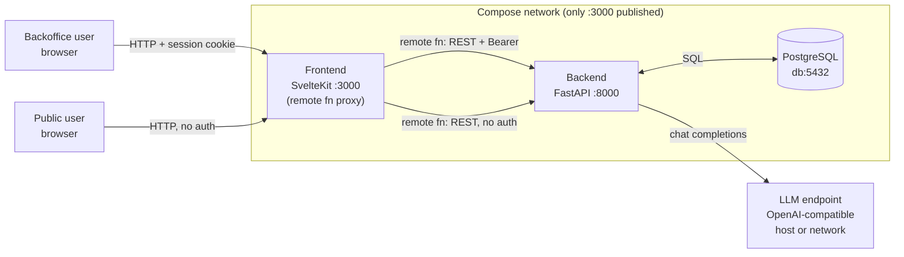

# Frontend — Real Estate AI Assistant

SvelteKit UI for the Real Estate AI Assistant. The browser talks to SvelteKit; SvelteKit talks to the FastAPI backend. Demo: <http://localhost:3000> after `docker compose up` at the repo root.

## Quickstart

The fastest way to run the full stack is compose (from the repo root):

```sh
cp .env.example .env
# edit .env: set SEED_ADMIN_PASSWORD (needed to log in) and
# LLM_BASE_URL / LLM_MODEL (needed for the AI chat). See comments in
# .env.example for the right LLM_BASE_URL on Docker Desktop vs Linux.
docker compose up --build
# open http://localhost:3000
```

To run only the frontend against a FastAPI process on `:8000`:

```sh
bun install
cp .env.example .env   # set BACKEND_PREFIX=http://localhost:8000
bun run dev
```

## Features

- **`/login`** — email/password sign-in (Skeleton card form).
- **`/public/ai-chat`** — anonymous AI chat; chat id is a UUID kept in `localStorage`, no account required.
- **`/dashboard`** — operator home.
- **`/dashboard/properties`** — property CRUD (list, new, view, edit, delete) with filters.
- **`/dashboard/ai-escalations`** — review human-handoff escalations with full chat transcript.

## Tech stack

- **SvelteKit 2.70** + **Svelte 5** (runes, `await` in templates).
- **Bun 1** as package manager and runtime; `svelte-adapter-bun` for production.
- **TypeScript 5**.
- **Tailwind v4** via `@tailwindcss/vite`.
- **Skeleton v3** (`@skeletonlabs/skeleton` + `@skeletonlabs/skeleton-svelte`, theme `cerberus`).
- **`bits-ui`** — headless primitives (available for future pages).
- **`valibot`** — standard-schema validation in remote functions.
- SvelteKit experimental: `compilerOptions.experimental.async`, `kit.experimental.remoteFunctions`, `kit.experimental.explicitEnvironmentVariables`.

## Architecture (frontend view)

The browser never talks to the FastAPI backend directly. All traffic enters through the SvelteKit frontend, which proxies requests to the backend in-network. The backend is not published; only the frontend's port (`3000`) is exposed.



## Local development

_(coming soon)_

## Docker / compose

_(coming soon)_

## Design decisions

_(coming soon)_
