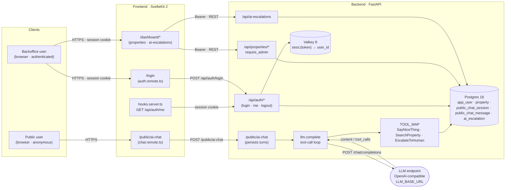

# Frontend — Real Estate AI Assistant

SvelteKit UI for the Real Estate AI Assistant. The browser talks to SvelteKit; SvelteKit proxies every request to FastAPI in-network.

Demo: <http://localhost:3000> (after `docker compose up` at the repo root).

## Quickstart

### 1. Set up `.env` (native dev only)

If you plan to run the frontend outside of Docker Compose, copy the example file. The default `BACKEND_PREFIX=http://localhost:8000` works as-is for a FastAPI running on your host.

```sh
cp .env.example .env
```

Skip this step if you're using Docker Compose — `compose.yaml` sets `BACKEND_PREFIX` and `ORIGIN` on the `frontend` service for you.

### 2. Run with Docker Compose (recommended)

From the repo root:

```sh
docker compose up --build
# open http://localhost:3000
```

The `frontend` service is the only port published (`3000:3000`). The FastAPI backend is not exposed to the host — SvelteKit reaches it in-network as `backend:8000`.

### 3. Run the frontend natively (alternative)

```sh
bun install
bun --bun run dev
```

## Features

- **`/login`** — Email + password sign-in, rendered as a Skeleton card form. The backend bearer token is set as an httpOnly `session` cookie; the browser never sees it.
- **`/public/ai-chat`** — Standalone anonymous chat against the same agent the authed surface uses. Chat state is keyed by a UUID stored in `localStorage` under `public-ai-chat:chat-id`; the backend mints a new `chat_id` on first turn. No `AppBar`, so the page can be embedded publicly.
- **`/dashboard`** — Operator home (gated by the `session` cookie via `hooks.server.ts`).
- **`/dashboard/properties`** — Property CRUD: list with filters, create, view, edit, delete. Uses a SvelteKit remote function (`properties.remote.ts`) and valibot schemas.
- **`/dashboard/ai-escalations`** — Review human-handoff escalations from the agent. The detail page renders the full chat transcript.

## Tech stack

- **SvelteKit 2.70** + **Svelte 5** — runes and `await` in templates.
- **Bun 1** — package manager and runtime; `svelte-adapter-bun` for the production build.
- **TypeScript 5** — strict; app types declared in `src/app.d.ts` and `src/lib/types.ts`.
- **Tailwind v4** — via `@tailwindcss/vite`; one `@import` in `src/routes/layout.css`.
- **Skeleton v3** — `@skeletonlabs/skeleton` + `@skeletonlabs/skeleton-svelte`, theme `cerberus` (set as `data-theme` on `<html>`).
- **`bits-ui`** — headless primitives, reserved for behavior Skeleton doesn't cover.
- **`valibot`** — standard-schema validation in remote `form` functions.
- **SvelteKit experimental** — `compilerOptions.experimental.async`, `kit.experimental.remoteFunctions`, `kit.experimental.explicitEnvironmentVariables`.

## Architecture (frontend view)

The frontend serves two personas from one SvelteKit app and is the only thing the browser talks to; the FastAPI backend is reachable only in-network.



### Request flow

**Backoffice (authenticated).** Browser → SvelteKit server. `hooks.server.ts` reads the `session` cookie and resolves the user via `GET /api/auth/me` (cached per-request) → route server file (`+page.server.ts` or `+page.remote.ts`) → `apiFetch` attaches `Authorization: Bearer …` from the same cookie → FastAPI route under `/api/...`. The bearer token from `POST /api/auth/login` never reaches the browser; it lives only in the httpOnly `session` cookie set by `auth.remote.ts`.

**Public (anonymous).** Browser → SvelteKit `/public/ai-chat` → `sendPublicMessage` (a `command` remote) → `apiFetch` calls `POST /public/ai-chat` with **no** `Authorization` header. The route is intentionally outside the auth path on the backend too — it's mounted at `/public/...`, not `/api/...`.

### LLM driver

The public chat route is the only place the backend talks to an LLM. The flow inside FastAPI (`app/public_chat/llm.complete`):

1. Persist the user's message and load prior turns for the `chat_id` (UUID minted server-side, stored in `localStorage` by the page).
2. `POST {LLM_BASE_URL}/chat/completions` with the message history and the tool list `TOOLS = [SayNiceThing, SearchProperty, EscalateToHuman]`.
3. If the response carries `tool_calls`, execute each via `TOOL_MAP` (some need the Postgres pool; `EscalateToHuman` additionally needs the `public_chat_id` injected by the route), append a `role: tool` message with the result, and re-POST. The loop is capped at **10 rounds** to bound latency and cost.
4. Persist the final `assistant` content. On LLM failure the user message stays persisted and the route returns `502` with `{ message, chat_id }` so the page can keep the session and retry the next turn.

`SearchProperty` is a thin wrapper over `app.properties.repository.list_properties` (hardcoded `status="AVAILABLE"`); `EscalateToHuman` inserts a row into `ai_escalation` against the current `public_chat_id` so the backoffice `/dashboard/ai-escalations` page has something to review. Both are read/written on the same Postgres pool the rest of the backend uses.

### Data stores

- **Postgres 18** owns all durable state: `app_user`, `property`, `public_chat_session`, `public_chat_message`, `ai_escalation`. Schema and indexes are applied at lifespan startup by `app/migrations.ensure_schema`.
- **Valkey 8** owns session tokens only. Keys are `sess:{token}` → `user_id` with a TTL of `AUTH_TOKEN_TTL_SECONDS` (default 24h).

### LLM endpoint

The backend speaks the OpenAI chat-completions shape to whatever `LLM_BASE_URL` points at — in dev, a llama.cpp server on the host (`http://localhost:1234/v1`); in prod, any OpenAI-compatible service. No streaming, no `Authorization` header unless `LLM_API_KEY` is set to something other than the `not-needed` placeholder.

## Local development

*To be filled in.*

## Docker / compose

*To be filled in.*

## Design decisions

*To be filled in.*
